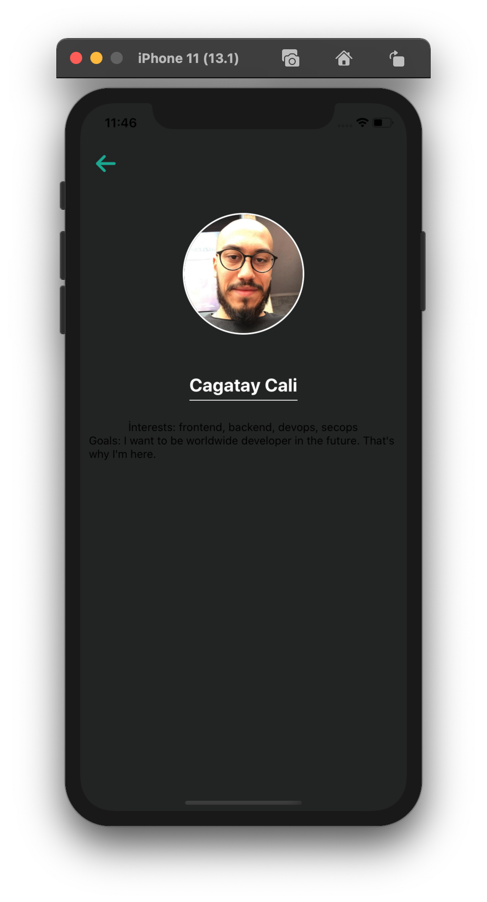

<a target="_blank" href="https://findmentor.network/"></a>
#
# Find Mentor Mobile App

The project's aim is to collect feedback from people. 
- Find & match mentors/mentees
    - w/o contract,
    - w/o protocol,
    - w/o ego
- Helps to understand the basics of being mentee / mentor.
- Helps to find new work buddies/pairs.


## Build Setup

```bash
# install dependencies
$ yarn install
$ npm install

# serve with hot reload at localhost:3000
$ yarn ios
$ yarn android

```
## ESLint Automatically Fix
```
$ yarn run lint -- --fix
$ npm run lint -- --fix
```
## API

**Get all persons by:**

```bash
curl https://findmentor.network/persons.json
```

**Get all active mentorships by:**

```bash
curl https://findmentor.network/activeMentorships.json
```
https://raw.githubusercontent.com/cagataycali/find-mentor/eb039271273f2fd431ee0ac88f82c1c33e1c9433/assets/img/core/logo.svg

## Current Screenshots

   
#
*For detailed explanation on how things work, check out [React Native](https://reactnative.dev/) docs.*
