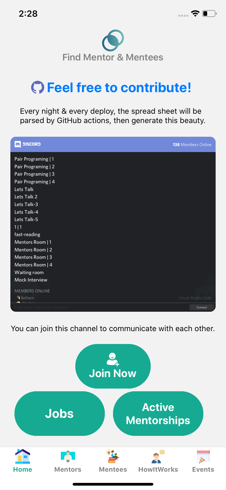
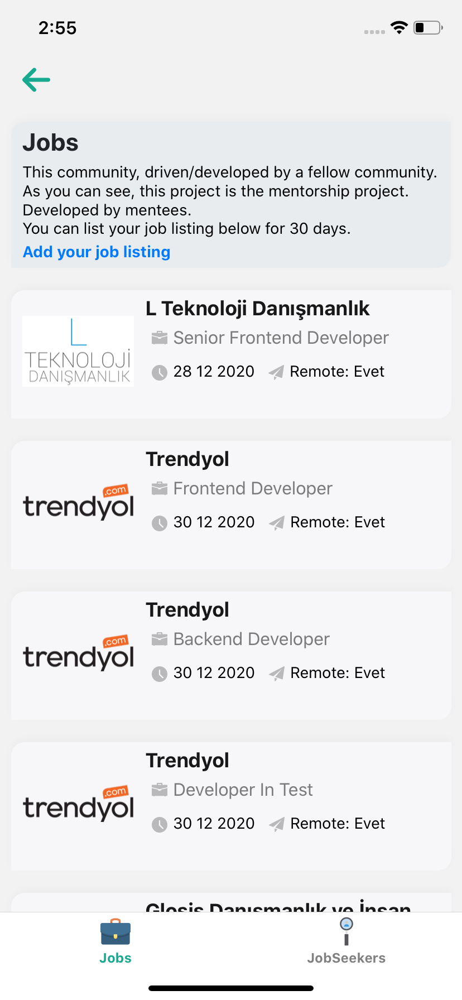
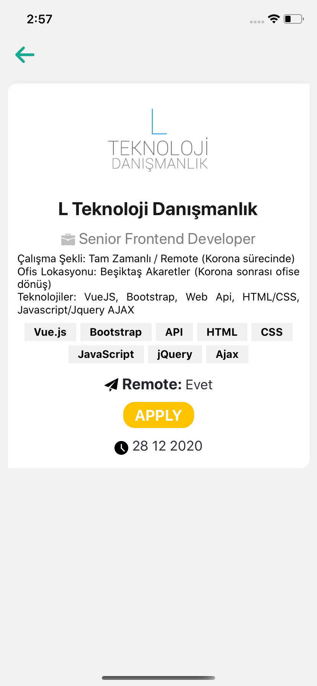
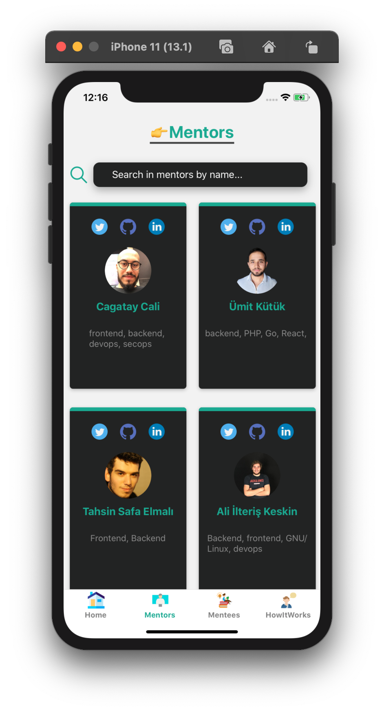
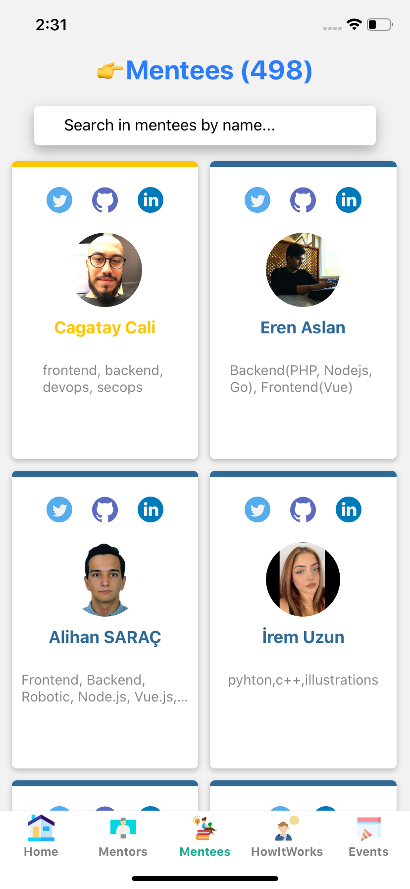
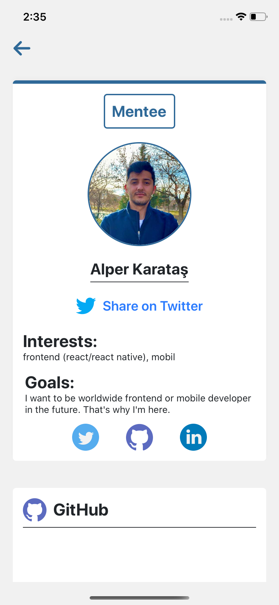
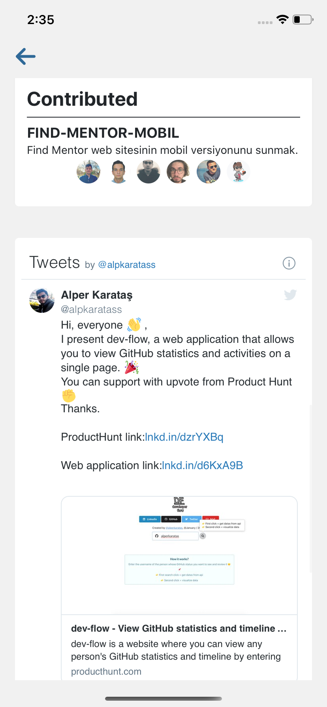
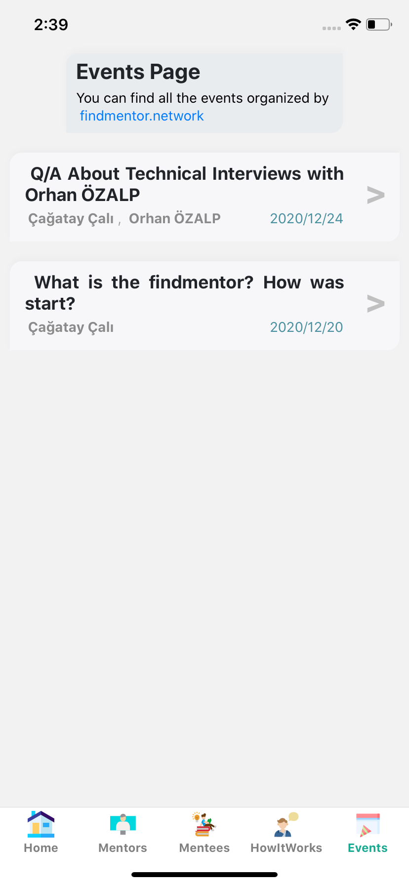

<a target="_blank" href="https://findmentor.network/"></a>

---

# [Find Mentor](https://github.com/cagataycali/find-mentor) Mobile App

The project's aim is to collect feedback from people.

- Find & match mentors/mentees

  - w/o contract,
  - w/o protocol,
  - w/o ego

- Helps to understand the basics of being mentee / mentor.
- Helps to find new work buddies/pairs.

## Build Setup

```bash
# install dependencies
$ yarn install

# serve with hot reload at localhost:3000
$ yarn ios
$ yarn android

```

## API

**Get all persons by:**

```bash
curl https://findmentor.network/persons.json
```

**Get all active mentorships by:**

```bash
curl https://findmentor.network/activeMentorships.json
```

**Get all jobs:**

```bash
curl https://findmentor.network/jobs.json
```

## Current Screenshots

             

---

_For detailed explanation on how things work, check out [React Native](https://reactnative.dev/) docs._
